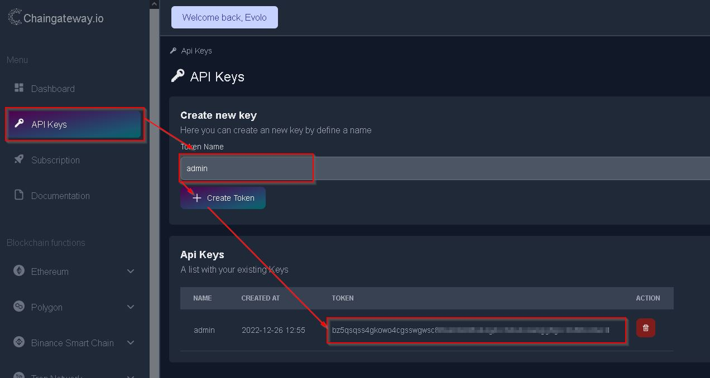
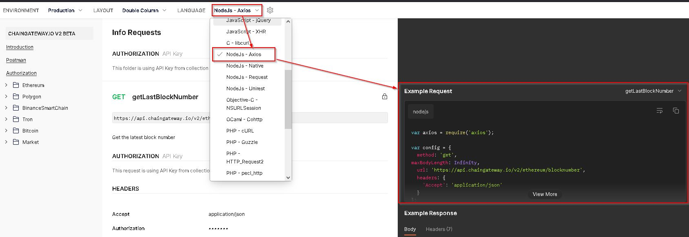

Welcome to the tutorial section. Here we have prepared some code examples for you to help you get started with our api. 

## Authentication
Every request needs an api key. You can easily create one in our web app. 

 

This api key must then be included in every request in the 'Authorization' header. 


"Authorization": "apikey"


## More examples

if your programming language is not supportet here, you can generate automatic examples in our api docs at ([docs.api.chaingateway.io](https://docs.api.chaingateway.io)) by selecting your language in the header section.

 
